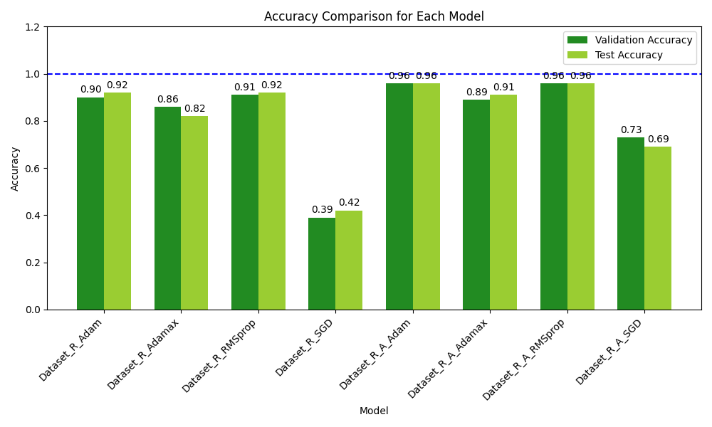

# Indonesian Traditional Weapon Classification using InceptionV3

## 📌 Project Overview
This project focuses on preserving Indonesian cultural heritage through computer vision. It implements a Deep Learning model based on **Transfer Learning (InceptionV3)** to classify 9 types of Indonesian traditional weapons.

The study also conducts a comprehensive comparative analysis of 4 different optimizers (Adam, Adamax, RMSprop, SGD) under two scenarios: **With Data Augmentation** and **Without Data Augmentation**.

## 📂 Dataset
The dataset was self-curated and manually cleaned to ensure quality. It consists of 9 classes of traditional weapons:
*   Busur
*   Clurit
*   Golok
*   Kerambit
*   Keris
*   Kudi
*   Plinteng
*   Tombak
*   Wedhung

## 🛠️ Methodology
*   **Base Model:** InceptionV3 (Pre-trained on ImageNet).
*   **Technique:** Transfer Learning & Fine-tuning.
*   **Experiment Scenarios:**
    1.  Raw Data Training.
    2.  Training with Data Augmentation (Rotation, Zoom, Flip, Shear).
*   **Optimizers Evaluated:** Adam, Adamax, RMSprop, SGD.

## 📊 Key Results & Analysis

The experiment reveals that **Data Augmentation combined with Adaptive Optimizers (Adam/RMSprop)** yields the best performance.

**Insights:**
1.  **Best Performance:** The model achieved approximately **96% Test Accuracy** using Adam and RMSprop optimizers combined with Data Augmentation.
2.  **Impact of Augmentation:** As seen in the chart (Green bars vs. Light Green bars), data augmentation significantly improves the model's generalization capability, preventing overfitting.
3.  **Optimizer Comparison:** SGD showed the lowest performance (below 75%), indicating it struggled to converge on this specific dataset compared to adaptive algorithms.

## 🖼️ Test Predictions
Below are sample predictions from the trained model on unseen test data. The model successfully identifies various weapon types with high confidence.

| Image | Description |
| :---: | :--- |
|  | **File:** Busur_2.jpg **Prediction:** Correctly identified as Busur |
|  | **File:** Clurit_13.jpg **Prediction:** Incorrectly identified as Kerambit |
|  | **File:** Kerambit_3.jpg **Prediction:** Correctly identified as Kerambit |
|  | **File:** Plinteng_3.jpg **Prediction:** Correctly identified as Plinteng |
|  | **File:** Tombak_7.jpg **Prediction:** Correctly identified as Tombak |

## 🚀 Technologies Used
*   **Core:** Python
*   **Deep Learning:** TensorFlow, Keras
*   **Data Processing:** NumPy, Pandas
*   **Visualization:** Matplotlib, Seaborn

---
**Author:** [Nama Anda]
*Open for freelance projects and collaboration in Machine Learning & Computer Vision.*
